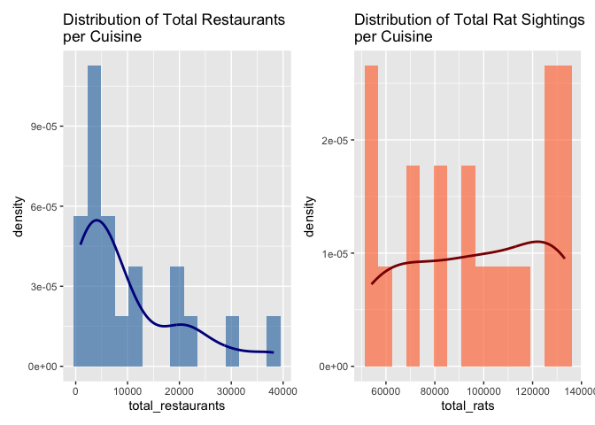

Rat_fave_cuisine_analysis
================
HsuanYi Lee (hl3858)
2025-11-17

``` r
restaurant <- readRDS("~/p8105_final_project/data/restaurant_clean.rds")
rat_data <- readRDS("~/p8105_final_project/data/rat_data_cleaned.rds")

restaurant <- restaurant %>% mutate(ZIPCODE_fill = as.character(ZIPCODE_fill))
rat_data <- rat_data %>% mutate(Zip = as.character(Zip))
```

## Create Cuisine Summary

``` r
cuisine_summary <- restaurant %>%
  select(CUISINE_CATEGORY, ZIPCODE_fill) %>%
  filter(ZIPCODE_fill != "") %>%
  group_by(CUISINE_CATEGORY, ZIPCODE_fill) %>%
  summarise(restaurant_count = n(), .groups = 'drop') %>%
  left_join(
    rat_data %>%
      filter(Zip != "") %>%
      group_by(Zip) %>%
      summarise(rat_count = n()),
    by = c("ZIPCODE_fill" = "Zip")
  ) %>%
  mutate(rat_count = replace_na(rat_count, 0)) %>%
  group_by(CUISINE_CATEGORY) %>%
  summarise(
    total_restaurants = sum(restaurant_count),
    total_rats = sum(rat_count),
    .groups = "drop"
  )
```

## Skewness Function

``` r
calculate_skewness <- function(x) {
n <- length(x)
mean_x <- mean(x)
sd_x <- sd(x)
(sum((x - mean_x)^3) / n) / (sd_x^3)
}
```

## Results: Restaurants

``` r
restaurant_stats <- cuisine_summary %>%
summarise(
n = n(),
mean = mean(total_restaurants),
median = median(total_restaurants),
sd = sd(total_restaurants),
min = min(total_restaurants),
max = max(total_restaurants),
skewness = calculate_skewness(total_restaurants),
shapiro_p = shapiro.test(total_restaurants)$p.value
)
restaurant_stats
```

    ## # A tibble: 1 × 8
    ##       n   mean median     sd   min   max skewness shapiro_p
    ##   <int>  <dbl>  <dbl>  <dbl> <int> <int>    <dbl>     <dbl>
    ## 1    20 10171.   6050 10492.   914 38198     1.22   0.00124

## Results: Rats

``` r
rat_stats <- cuisine_summary %>%
summarise(
n = n(),
mean = mean(total_rats),
median = median(total_rats),
sd = sd(total_rats),
min = min(total_rats),
max = max(total_rats),
skewness = calculate_skewness(total_rats),
shapiro_p = shapiro.test(total_rats)$p.value
)
rat_stats
```

    ## # A tibble: 1 × 8
    ##       n   mean median     sd   min    max skewness shapiro_p
    ##   <int>  <dbl>  <dbl>  <dbl> <int>  <int>    <dbl>     <dbl>
    ## 1    20 96630. 97886. 28466. 54080 133169   -0.140    0.0511

## Histograms

``` r
p1 <- ggplot(cuisine_summary, aes(x = total_restaurants)) +
geom_histogram(aes(y = ..density..), bins = 15, fill = "steelblue", alpha = 0.7) +
geom_density(color = "darkblue", linewidth = 1) +
labs(title="Distribution of Total Restaurants\nper Cuisine")

p2 <- ggplot(cuisine_summary, aes(x = total_rats)) +
geom_histogram(aes(y = ..density..), bins = 15, fill = "coral", alpha = 0.7) +
geom_density(color = "darkred", linewidth = 1) +
labs(title="Distribution of Total Rat Sightings\nper Cuisine")

p1 + p2
```

<!-- -->

## Rat Sightings Ranking by Cuisine (Adjusted for restaurants)

``` r
cuisine_rat_analysis <- restaurant %>%
select(CUISINE_CATEGORY, ZIPCODE_fill) %>%
group_by(CUISINE_CATEGORY, ZIPCODE_fill) %>%
summarise(Restaurant_Count = n(), .groups="drop") %>%
left_join(
rat_data %>% group_by(Zip) %>% summarise(Rat_Count = n()),
by = c("ZIPCODE_fill" = "Zip")
) %>%
mutate(Rat_Count = replace_na(Rat_Count, 0))

log_standardized_ranking <- cuisine_rat_analysis %>%
group_by(CUISINE_CATEGORY) %>%
summarise(
Total_Rats = sum(Rat_Count),
Total_Restaurants = sum(Restaurant_Count),
Unique_ZIPs = n_distinct(ZIPCODE_fill),
Rats_per_Restaurant = Total_Rats / Total_Restaurants
) %>%
filter(Total_Restaurants >= 50) %>%
mutate(
Log_Restaurants = log(Total_Restaurants + 1),
Standardized_Rats = scale(Total_Rats)[,1],
Standardized_Log_Restaurants = scale(Log_Restaurants)[,1],
Log_Standardized_Ratio = Standardized_Rats / Standardized_Log_Restaurants,
Normalized_Ratio = (Log_Standardized_Ratio - min(Log_Standardized_Ratio)) /
(max(Log_Standardized_Ratio) - min(Log_Standardized_Ratio))
) %>%
arrange(desc(Normalized_Ratio))

log_standardized_ranking %>%
select(CUISINE_CATEGORY, Total_Rats, Total_Restaurants, Normalized_Ratio) %>%
print(n = Inf)
```

    ## # A tibble: 20 × 4
    ##    CUISINE_CATEGORY                Total_Rats Total_Restaurants Normalized_Ratio
    ##    <chr>                                <int>             <int>            <dbl>
    ##  1 Italian                             108383              7174            1    
    ##  2 Korean                               56879              3094            0.937
    ##  3 Pizza                               130096             12828            0.802
    ##  4 French                               59055              2286            0.755
    ##  5 Indian                               71090              3113            0.755
    ##  6 South American                      115293             10246            0.723
    ##  7 Middle Eastern                       73232              2680            0.669
    ##  8 Fast Food                           130415             20601            0.657
    ##  9 Chinese Food                        127892             20342            0.641
    ## 10 Thai                                 80568              3111            0.629
    ## 11 South Asian, Southeast Asian &…     126573             21847            0.620
    ## 12 Beverages & Bakery/Desserts         133169             29234            0.619
    ## 13 Vegan & Vegetarian                   54080               914            0.614
    ## 14 African                              55591               973            0.614
    ## 15 American Food                       131423             38198            0.582
    ## 16 Japanese                             99976              7252            0.574
    ## 17 Seafood                              83675              1791            0.511
    ## 18 Fusion                               95795              4844            0.451
    ## 19 European                             93160              7961            0.310
    ## 20 Spanish                             106253              4926            0

## Rat Sightings Ranking (2.0 ZIP Weighted)

``` r
zip_weighted_ranking <- cuisine_rat_analysis %>%
group_by(CUISINE_CATEGORY) %>%
summarise(
Total_Rats = sum(Rat_Count),
Total_Restaurants = sum(Restaurant_Count),
Unique_ZIPs = n_distinct(ZIPCODE_fill)
) %>%
filter(Total_Restaurants >= 50) %>%
mutate(
Weighted_Rats = Total_Rats * Unique_ZIPs,
Log_Restaurants = log(Total_Restaurants + 1),
Std_Weighted = scale(Weighted_Rats)[,1],
Std_Log = scale(Log_Restaurants)[,1],
Log_Standardized_Ratio = Std_Weighted / Std_Log,
Normalized_Ratio = (Log_Standardized_Ratio - min(Log_Standardized_Ratio)) /
(max(Log_Standardized_Ratio) - min(Log_Standardized_Ratio))
) %>%
arrange(desc(Normalized_Ratio))

zip_weighted_ranking %>%
select(CUISINE_CATEGORY, Total_Rats, Total_Restaurants, Unique_ZIPs, Normalized_Ratio) %>%
print(n = Inf)
```

    ## # A tibble: 20 × 5
    ##    CUISINE_CATEGORY    Total_Rats Total_Restaurants Unique_ZIPs Normalized_Ratio
    ##    <chr>                    <int>             <int>       <int>            <dbl>
    ##  1 Korean                   56879              3094          66            1    
    ##  2 Italian                 108383              7174         133            0.977
    ##  3 Pizza                   130096             12828         162            0.942
    ##  4 Indian                   71090              3113          81            0.848
    ##  5 French                   59055              2286          60            0.804
    ##  6 Thai                     80568              3111          83            0.775
    ##  7 Fast Food               130415             20601         170            0.756
    ##  8 Middle Eastern           73232              2680          79            0.752
    ##  9 Beverages & Bakery…     133169             29234         174            0.696
    ## 10 Chinese Food            127892             20342         158            0.676
    ## 11 South Asian, South…     126573             21847         162            0.669
    ## 12 American Food           131423             38198         180            0.657
    ## 13 Fusion                   95795              4844         114            0.655
    ## 14 South American          115293             10246         132            0.627
    ## 15 African                  55591               973          52            0.604
    ## 16 Vegan & Vegetarian       54080               914          53            0.596
    ## 17 Seafood                  83675              1791          95            0.522
    ## 18 Spanish                 106253              4926         117            0.291
    ## 19 Japanese                 99976              7252         116            0.155
    ## 20 European                 93160              7961         112            0
