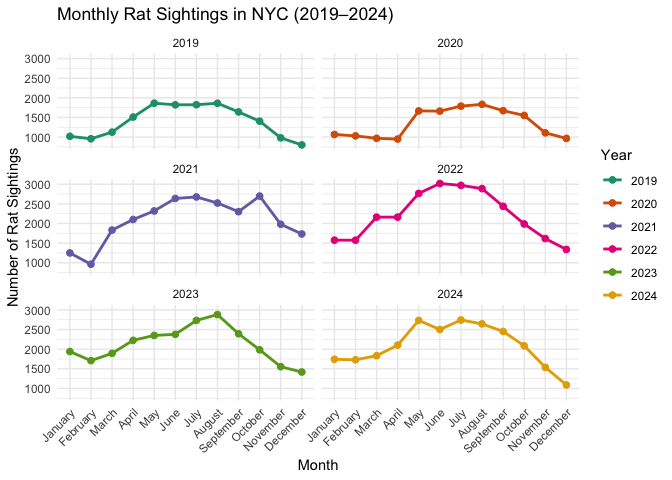
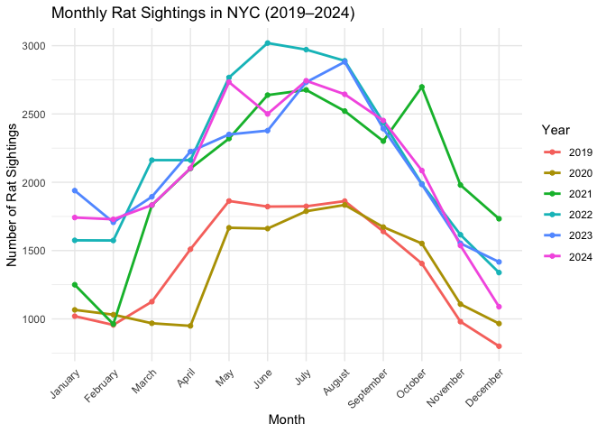

rat_sighting_time_trend
================
Zihan Xiong
2025-11-11

``` r
library(tidyverse)
```

    ## ── Attaching core tidyverse packages ──────────────────────── tidyverse 2.0.0 ──
    ## ✔ dplyr     1.1.4     ✔ readr     2.1.5
    ## ✔ forcats   1.0.0     ✔ stringr   1.5.1
    ## ✔ ggplot2   3.5.2     ✔ tibble    3.3.0
    ## ✔ lubridate 1.9.4     ✔ tidyr     1.3.1
    ## ✔ purrr     1.1.0     
    ## ── Conflicts ────────────────────────────────────────── tidyverse_conflicts() ──
    ## ✖ dplyr::filter() masks stats::filter()
    ## ✖ dplyr::lag()    masks stats::lag()
    ## ℹ Use the conflicted package (<http://conflicted.r-lib.org/>) to force all conflicts to become errors

``` r
library(readr)
library(janitor)
```

    ## 
    ## Attaching package: 'janitor'
    ## 
    ## The following objects are masked from 'package:stats':
    ## 
    ##     chisq.test, fisher.test

``` r
library(dplyr)
library(lubridate)
library(ggplot2)
```

``` r
rat=read_csv("./data/rat_sighting_raw1.csv", na=c("NA","","0"))|>
  janitor::clean_names()
```

    ## Warning: One or more parsing issues, call `problems()` on your data frame for details,
    ## e.g.:
    ##   dat <- vroom(...)
    ##   problems(dat)

    ## Rows: 259233 Columns: 18
    ## ── Column specification ────────────────────────────────────────────────────────
    ## Delimiter: ","
    ## chr (9): Created Date, Closed Date, Incident Address, City, Landmark, Facili...
    ## dbl (2): Unique Key, Incident Zip
    ## lgl (7): Vehicle Type, Taxi Company Borough, Taxi Pick Up Location, Bridge H...
    ## 
    ## ℹ Use `spec()` to retrieve the full column specification for this data.
    ## ℹ Specify the column types or set `show_col_types = FALSE` to quiet this message.

``` r
glimpse(rat)
```

    ## Rows: 259,233
    ## Columns: 18
    ## $ unique_key               <dbl> 63575470, 63572156, 63580575, 63583963, 63573…
    ## $ created_date             <chr> "2024 Dec 31 10:58:24 PM", "2024 Dec 31 10:49…
    ## $ closed_date              <chr> "2025 Jan 03 09:32:40 AM", "2025 Jan 03 09:32…
    ## $ incident_zip             <dbl> 10475, 10475, 10029, 11215, 10021, 11101, 114…
    ## $ incident_address         <chr> "3550 BIVONA STREET", "3550 BIVONA STREET", "…
    ## $ city                     <chr> "BRONX", "BRONX", "NEW YORK", "BROOKLYN", "NE…
    ## $ landmark                 <chr> "BIVONA STREET", "BIVONA STREET", "PLEASANT A…
    ## $ facility_type            <chr> "N/A", "N/A", "N/A", "N/A", "N/A", "N/A", "N/…
    ## $ community_board          <chr> "12 BRONX", "12 BRONX", "11 MANHATTAN", "06 B…
    ## $ borough                  <chr> "BRONX", "BRONX", "MANHATTAN", "BROOKLYN", "M…
    ## $ park_borough             <chr> "BRONX", "BRONX", "MANHATTAN", "BROOKLYN", "M…
    ## $ vehicle_type             <lgl> NA, NA, NA, NA, NA, NA, NA, NA, NA, NA, NA, N…
    ## $ taxi_company_borough     <lgl> NA, NA, NA, NA, NA, NA, NA, NA, NA, NA, NA, N…
    ## $ taxi_pick_up_location    <lgl> NA, NA, NA, NA, NA, NA, NA, NA, NA, NA, NA, N…
    ## $ bridge_highway_name      <lgl> NA, NA, NA, NA, NA, NA, NA, NA, NA, NA, NA, N…
    ## $ bridge_highway_direction <lgl> NA, NA, NA, NA, NA, NA, NA, NA, NA, NA, NA, N…
    ## $ road_ramp                <lgl> NA, NA, NA, NA, NA, NA, NA, NA, NA, NA, NA, N…
    ## $ bridge_highway_segment   <lgl> NA, NA, NA, NA, NA, NA, NA, NA, NA, NA, NA, N…

``` r
rat
```

    ## # A tibble: 259,233 × 18
    ##    unique_key created_date       closed_date incident_zip incident_address city 
    ##         <dbl> <chr>              <chr>              <dbl> <chr>            <chr>
    ##  1   63575470 2024 Dec 31 10:58… 2025 Jan 0…        10475 3550 BIVONA STR… BRONX
    ##  2   63572156 2024 Dec 31 10:49… 2025 Jan 0…        10475 3550 BIVONA STR… BRONX
    ##  3   63580575 2024 Dec 31 10:28… 2025 Jan 0…        10029 293 PLEASANT AV… NEW …
    ##  4   63583963 2024 Dec 31 06:15… 2025 Jan 0…        11215 441 13 STREET    BROO…
    ##  5   63573818 2024 Dec 31 06:10… 2024 Dec 3…        10021 144 EAST   74 S… NEW …
    ##  6   63572161 2024 Dec 31 06:04… 2024 Dec 3…        11101 21-06 45 AVENUE  LONG…
    ##  7   63578888 2024 Dec 31 05:26… 2025 Jan 0…        11432 160-19 GRAND CE… JAMA…
    ##  8   63577241 2024 Dec 31 05:05… 2024 Dec 3…        11233 68 SOMERS STREET BROO…
    ##  9   63583968 2024 Dec 31 04:47… 2025 Jan 0…        11377 47-34 45 STREET  WOOD…
    ## 10   63572155 2024 Dec 31 04:31… 2024 Dec 3…        10456 320 EAST  167 S… BRONX
    ## # ℹ 259,223 more rows
    ## # ℹ 12 more variables: landmark <chr>, facility_type <chr>,
    ## #   community_board <chr>, borough <chr>, park_borough <chr>,
    ## #   vehicle_type <lgl>, taxi_company_borough <lgl>,
    ## #   taxi_pick_up_location <lgl>, bridge_highway_name <lgl>,
    ## #   bridge_highway_direction <lgl>, road_ramp <lgl>,
    ## #   bridge_highway_segment <lgl>

``` r
rat1= rat |>
  mutate(
    created_date=parse_date_time(created_date, orders = "Y b d I:M:S p") 
  ) 
rat1
```

    ## # A tibble: 259,233 × 18
    ##    unique_key created_date        closed_date      incident_zip incident_address
    ##         <dbl> <dttm>              <chr>                   <dbl> <chr>           
    ##  1   63575470 2024-12-31 22:58:24 2025 Jan 03 09:…        10475 3550 BIVONA STR…
    ##  2   63572156 2024-12-31 22:49:24 2025 Jan 03 09:…        10475 3550 BIVONA STR…
    ##  3   63580575 2024-12-31 22:28:26 2025 Jan 02 07:…        10029 293 PLEASANT AV…
    ##  4   63583963 2024-12-31 18:15:58 2025 Jan 02 10:…        11215 441 13 STREET   
    ##  5   63573818 2024-12-31 18:10:15 2024 Dec 31 06:…        10021 144 EAST   74 S…
    ##  6   63572161 2024-12-31 18:04:50 2024 Dec 31 06:…        11101 21-06 45 AVENUE 
    ##  7   63578888 2024-12-31 17:26:40 2025 Jan 03 03:…        11432 160-19 GRAND CE…
    ##  8   63577241 2024-12-31 17:05:26 2024 Dec 31 05:…        11233 68 SOMERS STREET
    ##  9   63583968 2024-12-31 16:47:45 2025 Jan 03 03:…        11377 47-34 45 STREET 
    ## 10   63572155 2024-12-31 16:31:51 2024 Dec 31 04:…        10456 320 EAST  167 S…
    ## # ℹ 259,223 more rows
    ## # ℹ 13 more variables: city <chr>, landmark <chr>, facility_type <chr>,
    ## #   community_board <chr>, borough <chr>, park_borough <chr>,
    ## #   vehicle_type <lgl>, taxi_company_borough <lgl>,
    ## #   taxi_pick_up_location <lgl>, bridge_highway_name <lgl>,
    ## #   bridge_highway_direction <lgl>, road_ramp <lgl>,
    ## #   bridge_highway_segment <lgl>

``` r
rat_cleaned = rat1 |>
  filter(
    year(created_date) >=2019 & year(created_date) <=2024
  ) |>
  mutate(
    year=year(created_date),
    month = month(created_date, label = TRUE, abbr = FALSE)
  )|>
  group_by(year,month) |>
  summarise(rat_sighting_count = n())
```

    ## `summarise()` has grouped output by 'year'. You can override using the
    ## `.groups` argument.

``` r
rat_cleaned
```

    ## # A tibble: 72 × 3
    ## # Groups:   year [6]
    ##     year month     rat_sighting_count
    ##    <dbl> <ord>                  <int>
    ##  1  2019 January                 1020
    ##  2  2019 February                 956
    ##  3  2019 March                   1126
    ##  4  2019 April                   1510
    ##  5  2019 May                     1863
    ##  6  2019 June                    1822
    ##  7  2019 July                    1824
    ##  8  2019 August                  1862
    ##  9  2019 September               1640
    ## 10  2019 October                 1405
    ## # ℹ 62 more rows

``` r
rat_cleaned$month <- factor(
  rat_cleaned$month,
  levels = month.name,
  ordered = TRUE
)

ggplot(rat_cleaned, 
       aes(x = month, y = rat_sighting_count)) +
  geom_line(aes(group = year, colour = factor(year)), size = 1) +
  geom_point(aes(colour = factor(year)), size = 2) +
  facet_wrap(~ year, ncol = 2) +
  scale_color_brewer(palette = "Dark2") +
  labs(
    title = "Monthly Rat Sightings in NYC (2019–2024)",
    x="Month",
    y="Number of Rat Sightings",
    color="Year"
  ) +
  theme_minimal() +
  theme(axis.text.x = element_text(angle = 45, hjust = 1))
```

    ## Warning: Using `size` aesthetic for lines was deprecated in ggplot2 3.4.0.
    ## ℹ Please use `linewidth` instead.
    ## This warning is displayed once every 8 hours.
    ## Call `lifecycle::last_lifecycle_warnings()` to see where this warning was
    ## generated.

<!-- -->

``` r
ggplot(rat_cleaned, aes(x = month, y = rat_sighting_count, group = year, color = factor(year))) +
  geom_line(size = 1) +
  geom_point() +
  labs(
    title = "Monthly Rat Sightings in NYC (2019–2024)",
    x = "Month",
    y = "Number of Rat Sightings",
    color = "Year"
  ) +
  theme_minimal() +
  theme(
    axis.text.x = element_text(angle = 45, hjust = 1)
  )
```

<!-- -->

``` r
# library(plotly) will be used when conducting html_document

#plot_ly(
#  rat_cleaned,
# x = ~month,
 # y = ~rat_sighting_count,
  #color = ~factor(year),
  #type = 'scatter',
  #mode = 'lines+markers'
#) %>%
 # layout(
  #  title = "Monthly Rat Sightings in NYC (2019–2024)",
  #  xaxis = list(title = "Month"),
  #  yaxis = list(title = "Number of Rat Sightings")
  #)
```
